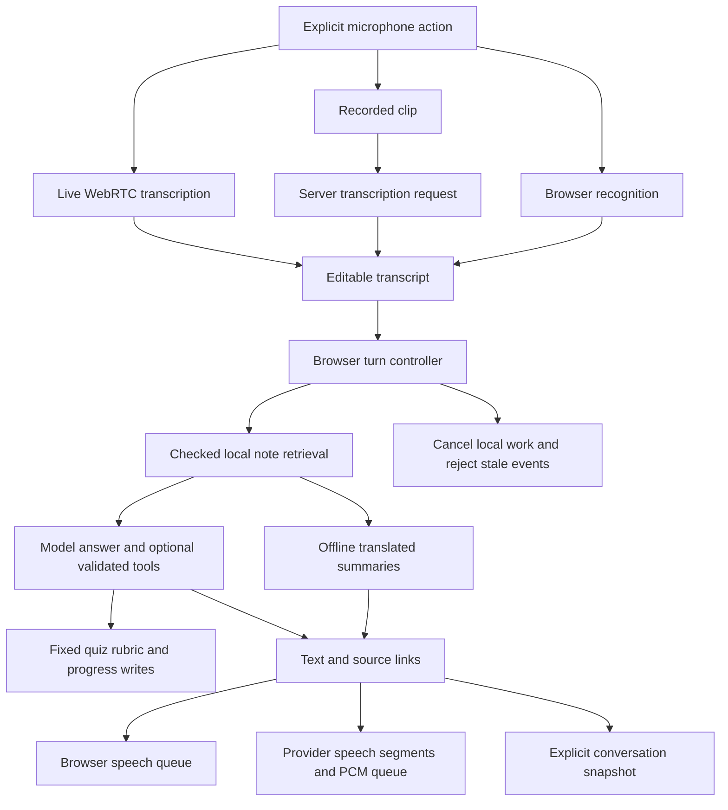

# BolPrep technical walkthrough

This describes the current repository implementation. It is not a recorded demo or evidence that the speech loop works on a device. Use [PROJECT_STATUS.md](PROJECT_STATUS.md) for acceptance gaps and [DEMO_SCRIPT.md](DEMO_SCRIPT.md) for an observation-based recording outline.

## Follow one learner turn

The diagram shows responsibilities, not separate deployed services. The browser is plain HTML/JavaScript, the server uses Python's HTTP server, and storage is local SQLite. Live transcription media connects directly to the provider; recorded transcription passes its completed clip through the local server.

1. The learner explicitly starts Speak, Record, or Live mic. Each path owns capture state and cancellation. Typed input bypasses speech recognition.
2. Recognition produces editable text. Partial text is not an authoritative answer. Ordinary input waits for a final transcript; opt-in automatic/continuous flows have separate submission and length checks.
3. The browser submits the current question, bounded recent history, selected language, and quiz preset to the agent route. The server validates these fields and applies local access/rate/concurrency controls.
4. Retrieval uses checked article notes. An explicit current article or supported substantive current topic takes priority; generic clarifications can use recent context. Quiz/restored-message article hints identify a topic without asserting that a learner answer is correct. Provider messages receive role/content only.
5. Offline mode returns labeled note summaries. Model mode attaches retrieved evidence to the question and requests short grounded answers. Source links are displayed separately; retrieval is not proof that every generated claim is supported.
6. Model text streams as NDJSON events. Ordinary explanation turns can feed sentence/chunk speech queues before text completion. Tool-intent turns use their validated results before the quiz flow proceeds.
7. Stop, interruption, or a superseding action aborts local requests and clears playback/capture work through the relevant ownership guards. Client abort does not establish provider cancellation or roll back an already completed score write.

## Where to read the code

| Responsibility | Code |
| --- | --- |
| Composer, turn identity, speech queues, quiz UI, playback notes | `web/app.js`: `sendQuestion`, `stopTutor`, `rememberMessage`, playback/capture helpers |
| Live media connection, item identity, commit/clear acknowledgments, quiet-pause handling | `web/live-stt.js` |
| HTTP contracts, provider credentials, streaming events, local request limits | `server.py`, `request_limits.py`, `access.py` |
| Checked notes, reference parsing, translated lexical index, context query construction | `retrieval.py`, `conversation_history.py` |
| Offline summaries and selected response-language instructions | `bolprep.py` |
| Bounded Responses tool loop and server-side argument handling | `agent.py` |
| Preset question pools and lexical concept scoring | `quiz.py`, `data/quiz_questions.json` |
| Quiz ownership, idempotent results, weak topics | `progress.py` |
| Explicit text/request-metadata snapshots and browser restore controls | `session_history.py`, `web/session-history.js` |
| Actual-source edition/provenance records | `data/SOURCE_REVIEW.md`, `data/corpus_manifest.json` |
| Constructed inputs, review procedures, local report runners | `evals/DATASETS.md` and neighboring tools |

## Speech path tradeoffs in this implementation

| Path | What the code offers | What still needs evidence |
| --- | --- | --- |
| Browser recognition | No BolPrep model credential is needed; final transcript review and optional auto-submit | Browser/device support and recognition quality; do not describe it as guaranteed offline audio processing |
| Recorded transcription | Bounded clip, server-side provider request, captured language fixed at recording start | Full-clip turnaround, STT errors, and recording cleanup on real devices |
| Live transcription | Direct WebRTC audio, partial/final text, manual Done or opt-in quiet-pause/continuous mode | Natural pauses, echo/noise handling, final-word retention, and real connection recovery |
| Browser speech | Installed voice/rate selection, sentence queues, explicit replay | Available voices and multilingual pronunciation; synthesis events are not acoustic measurements |
| Provider speech | Bounded text segments, streamed PCM scheduling, explicit provider usage | Audible start/gaps, pronunciation, real interruption, and actual usage/cost |

These are different code paths, not a benchmark ranking. Provider paths may incur usage. A browser path's lack of a BolPrep API key does not prove its browser speech service keeps audio local. Compare matched phrases/settings/device conditions using the run sheet before choosing a path based on measured quality.

## Turn and data boundaries

- Capture-run, model-turn, and speech-turn identities serve different lifetimes. A late result must belong to its current owner before changing the draft or scheduling output. Recorder cleanup also checks resource ownership so cancellation cannot leave an old recorder holding the microphone merely because its run counter advanced.
- Quiet-pause detection is a browser energy heuristic. Commit/final/clear stages have explicit state and acknowledgment handling; the microphone is muted during finalization/clearing. Speech in that interval can be lost. There is no automatic background reconnection or recording.
- Progressive text, final text, and heard speech are different facts. A completed text answer can remain visible after speech interruption; bounded model history gets an incomplete-playback note without claiming which words were heard.
- Quiz scoring is a fixed lexical rubric, not a model judge. The server binds writes to the browser's quiz ownership and retry key. The model scoring tool receives no answer-text argument: the server scores the entire current learner submission, excluding supplied notes and older messages. A nearby explicit rubric-concept denial withholds automatic credit for the whole answer (zero/incomplete); this is a bounded heuristic rather than semantic grading and can undercredit partially correct answers. Cookie identity is assigned without opening SQLite; quiz creation inserts its persisted owner and quiz together. Ordinary tutoring/speech can therefore proceed without progress storage, while persistence operations report their own failures. Migrated attempts without a retry key remain historical progress but return a conflict on submission, because the server cannot identify the request as an original retry. Matching-key requests still return the retained first result; keys identify operations, not stored raw answers. Progress schema setup and legacy migration acquire a SQLite write lock before schema inspection and commit together. Failed migration work rolls back; the existing ten-second SQLite lock timeout remains, so prolonged contention can still fail visibly. `score_answer` validates quiz ownership and retains a deep-copied unsaved rubric result in memory for the current turn. `save_progress` accepts only that turn's server-issued score ID and persists the retained result with the ID as its retry key; model-supplied marks are rejected. Unsaved previews disappear after the turn. One successful quiz creation or score preview is allowed per turn. Scored narration uses deterministic feedback and verified save status. The direct quiz endpoint still scores and saves in one request.
- Basic/Standard/Challenge are author-assigned question groups. They do not change the rubric or establish pedagogical difficulty. Progress groups results by question ID rather than separately storing the preset.
- Quiz scores exclude raw answer text. Explicit conversation saves can include recent question/answer text, citations, and available request metadata. Opening restores text/context without resuming quiz state or playing audio. Recent quiz text can also accompany later model questions.
- Master provider credentials stay in the server environment. Live setup returns a short-lived provider client secret for the browser connection, not the master API key. The optional shared demo gate and opaque progress cookie are local prototype controls, not separate authenticated learner accounts.

## A reviewed defect that led to a correction

The Article 14 rubric distinguishes equality before the law from equal protection. Static review found `barabari before law` and `कानून के सामने बराबरी` under the equal-protection concept even though each also contains an equality alias. With the old lexical loop, either phrase could therefore match both concepts. This is a consequence inferred from the checked data and matching code, not a measured quiz trial.

| Stage | Phrase ownership and matching behavior |
| --- | --- |
| Before `bf7763e` | A broad equality alias matched the phrase, while a second alias assigned the same wording to equal protection |
| Correction | Move the equality-before-law phrases into the equality concept; recognize existing translated feedback labels as phrases |
| Authoring guard | Reject normalized wordless phrases and phrase containment across distinct concepts within a question |
| Remaining limitation | Negated, contradictory, quoted, or unseen paraphrased wording still needs human review; a lexical hit does not establish meaning |

The guard applies to rubric authoring. A student can still mention two separate concept phrases in one answer. Existing saved scores are not recomputed. The question-bank hash changed, so historical reviews belong with their original bank/configuration. Scoring and guard acceptance have not been verified at runtime for this change.

## Explain measurements honestly

Live input waits at most three seconds for an already-started audio-context resume before judging detection unavailable. Cancellation releases this wait; closed-state and duplicate-start guards prevent late resume from enabling tracks. Provider speech commits HTTP success only after a first nonempty bounded PCM chunk; an empty or immediately failing stream returns generic JSON 502, while later errors close the incomplete chunked response.

The page reports software events: transcript timing, model text timing, PCM scheduling or browser synthesis start, and local cancellation dispatch. They exclude actual sound reaching the listener. Request token usage is separate from speech usage and monetary cost; missing usage stays unavailable. The configured model label is recorded separately from provider-reported tutor model IDs, in response/tool-round order. Missing or invalid IDs stay null; offline turns report an empty list. Older traces can omit this optional field, and failed turns do not claim completed-response identity. The report groups by this ordered list; returned IDs may still be aliases and do not establish immutable model versions or speech-model provenance.

Request metadata inside a saved conversation remains a client snapshot. Separately, explicit opt-in tutor trace retention records server-owned allowlisted metadata in trace_store.py, with cookie-scoped read/delete endpoints, a 100-row cap, and seven-day pruning on read/write. It stores no learner text/audio and does not create hosted learner accounts. Opted-out tutor turns do not open trace storage; a failed save does not fail the tutor turn. Failed turns retain observed source counts and metadata-only tool outcomes even if the final model response fails after a successful save; usage remains unknown without a completed result. Disconnect means an observed HTTP write failure, not upstream cancellation. The speech collection planner freezes planned prompt/configuration coverage and exports only fully observed selected splits with provenance hashes; it does not authenticate the supplied observations. Local report tools validate structure/coverage and summarize supplied observations, but cannot authenticate identities or prove representative sampling. The human TTS and quiz procedures exist; actual listener/reviewer observations and current benchmark reports remain missing.

For a recorded walkthrough, first show observed behavior, then trace it through the files above. Explain one path tradeoff and the reviewed rubric defect. Label unavailable provider/device checks, distinguish static reasoning from actual measurements, and use the acceptance audit to state what remains open.
